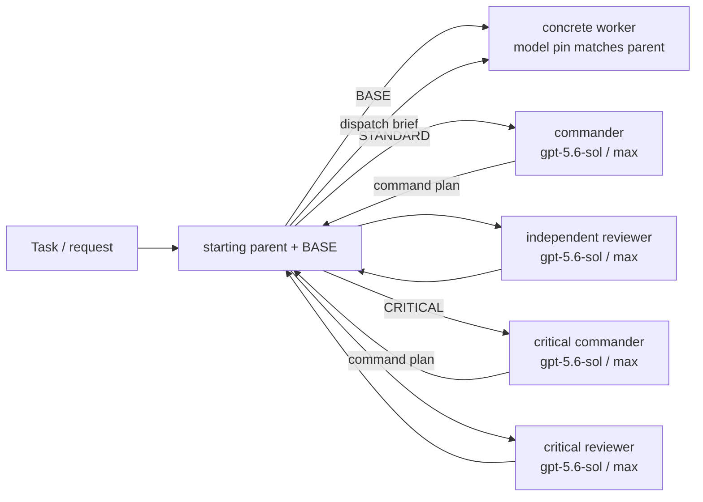

# Codex Architecture Mode

This repository translates the `fable-advisor` architect-as-orchestrator idea and the Shann-inspired self-correcting routing mindset into Codex App-native custom agents. It uses only models available in Codex.

The outer parent keeps the current starting parent model as the BASE executor. In `auto`, 5.6-family starting parents native-bypass to OFF. Verified non-5.6 starts (`gpt-5.3-codex-spark`, `gpt-5.4`, `gpt-5.4-mini`, and `gpt-5.5`) route through an immutable model-pinned worker role selected in the per-turn v3 marker. Hidden/internal and unknown future models stay native OFF until a pinned role and canary exist. An explicit user-selected parent-model override remains allowed. This is agent routing, not an attempt to mutate the parent task's model selector mid-turn.

## Roles

| Role | Model | Reasoning | Use when |
| --- | --- | --- | --- |
| Starting parent / BASE | selected parent | BASE / native | intake, BASE, routine, well-specified, read-heavy, or mechanical work |
| Architect / STANDARD commander | `gpt-5.6-sol` (fallback: Terra → 5.5 → 5.4) | `max` | direct non-routine work, decomposition, interfaces, execution routing, and proof design |
| Worker / implementation | marker-selected static pin matching starting parent | inherited effort | routine, well-specified, read-heavy, or mechanical work |
| Reviewer / STANDARD reviewer | `gpt-5.6-sol` (fallback: Terra → 5.5 → 5.4) | `max` | standard correctness, regression, test, and evidence review |
| Critical architect / CRITICAL commander | `gpt-5.6-sol` (fallback: Terra → 5.5 → 5.4) | `max` | direct genuinely high-impact execution and proof strategy |
| Critical reviewer | `gpt-5.6-sol` (fallback: Terra → 5.5 → 5.4) | `max` | production, security, data-loss, irreversible, repeated-failure, or unresolved high-impact decisions |

## Flow

## AI routing rules

1. Before the first substantive tool call, classify the request semantically as BASE, STANDARD, or CRITICAL from intent, ambiguity, verification volume, failure impact, and current evidence. Do not route from keyword matching alone.
2. BASE is limited to one bounded source or operation with no meaningful implementation, multi-stage verification, or independent review requirement. Comparing two or more independent sources, non-trivial implementation, or multi-stage verification is at least STANDARD.
3. STANDARD must start by spawning architect with `fork_turns="none"`, then immediately waiting. The outer parent must not perform target work before receiving the command plan.
4. The architect owns judgment and returns an authoritative command plan with a worker brief and reviewer acceptance criteria. It does not spawn nested children.
5. The outer parent is a mechanical dispatcher: it sends the architect's bounded brief to the exact concrete `worker_agent_type` in the v3 marker and then sends the evidence plus acceptance criteria to reviewer, both with `fork_turns="none"`. The worker's static model pin equals the effective starting parent model, its effort is inherited, and it receives no ad hoc overrides. Generic `agent_type="worker"` is rewritten by the spawn guard and is not valid completion evidence on its own.
6. CRITICAL starts the same way with critical_architect. The parent dispatches its plan and uses critical_reviewer only for the decisive high-impact final judgment.
7. A required lane is satisfied only by an actual collaboration result in the current task. Saying a lane should be used or performing a parent self-review is not a substitute.
8. Spawn or pinned-model failure is a blocker unless the failure is model-level unavailability. For a native Codex model-level failure, try the bounded same-role fallback chain once per candidate and record a `model_fallback.v1` receipt with the requested/selected model, compatible reasoning effort, exact failure code, and the Codex App tool/thread provenance; a fallback result is not evidence that the primary model ran. When using the high-level Codex App tools, resend the same bounded packet on the same thread with the next `model`/`thinking` pair; do not create a replacement thread. A missing role, wrong pin, project/global role drift, unknown parent model, safety failure, or malformed output remains a blocker or normal retry, not model substitution.
9. Agent disagreement, missing proof, or a failed verification is routing feedback. The dispatcher must return it to the commander or escalate instead of silently accepting the first result.
10. The outer parent checks the command plan, worker evidence, and reviewer verdict, then reports to the user without replacing strong-model judgment with its own.
11. A historical parent-only memory applies only when the user explicitly requests parent-only execution in the current task.
12. Nested custom-agent orchestration is intentionally disabled because current Codex does not reliably propagate nested child results. Custom `agent_type` calls use fresh bounded prompts with `fork_turns="none"` from the outer parent.

## What changed from `fable-advisor`

- Kept expensive judgment separate from high-volume implementation.
- Kept context lean by delegating bounded exploration, implementation, and review.
- Replaced vendor-diverse lanes with Codex-native model tiers.
- Kept the strong commander on `gpt-5.6-sol / max` while a concrete worker role pins the exact starting-parent model and inherits its effort.
- Added separate critical commander and reviewer contracts so high-impact work remains stricter even though STANDARD and CRITICAL use the same Sol model.
- Kept evidence-based completion and explicit, receipt-backed native model fallback instead of silent substitution.

## Source of truth

- [`adaptive-orchestration-manifest.v1.json`](adaptive-orchestration-manifest.v1.json) is the narrow recovery allowlist and exclusion boundary.
- [`adaptive-orchestration-recovery.md`](adaptive-orchestration-recovery.md) is the portable, self-contained restore procedure.
- [`../src/social_flow/codex_model_dispatch.py`](../src/social_flow/codex_model_dispatch.py) is the canonical native dispatch adapter: callers pass a fresh model-preflight set, classify only structured model-level failures as fallback-eligible, and persist the returned `model_fallback.v1` receipt.
- [`codex-ux-contract.md`](codex-ux-contract.md)
- [`.codex/agents/architect.toml`](../.codex/agents/architect.toml)
- [`.codex/agents/worker_gpt_5_3_codex_spark.toml`](../.codex/agents/worker_gpt_5_3_codex_spark.toml)
- [`.codex/agents/worker_gpt_5_4.toml`](../.codex/agents/worker_gpt_5_4.toml)
- [`.codex/agents/worker_gpt_5_4_mini.toml`](../.codex/agents/worker_gpt_5_4_mini.toml)
- [`.codex/agents/worker_gpt_5_5.toml`](../.codex/agents/worker_gpt_5_5.toml)
- [`.codex/agents/reviewer.toml`](../.codex/agents/reviewer.toml)
- [`.codex/agents/critical_architect.toml`](../.codex/agents/critical_architect.toml)
- [`.codex/agents/critical_reviewer.toml`](../.codex/agents/critical_reviewer.toml)
