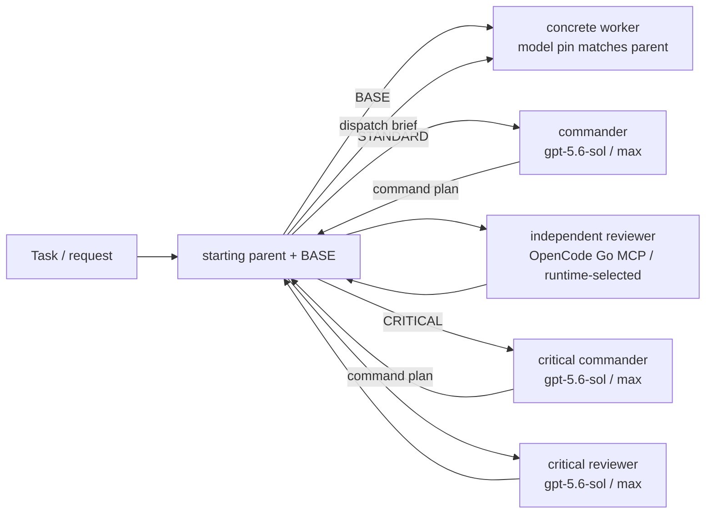

# Codex Architecture Mode

This repository translates the `fable-advisor` architect-as-orchestrator idea and the Shann-inspired self-correcting routing mindset into Codex App-native custom agents, with a direct OpenCode Go MCP route for the STANDARD reviewer only.

The outer parent keeps the current starting parent model as the BASE executor. In `auto`, 5.6-family starting parents native-bypass to OFF. Verified non-5.6 starts (`gpt-5.3-codex-spark`, `gpt-5.4`, `gpt-5.4-mini`, and `gpt-5.5`) route through an immutable model-pinned worker role selected in the per-turn v3 marker. Hidden/internal and unknown future models stay native OFF until a pinned role and canary exist. An explicit user-selected parent-model override remains allowed. This is agent routing, not an attempt to mutate the parent task's model selector mid-turn.

## Roles

| Role | Model | Reasoning | Use when |
| --- | --- | --- | --- |
| Starting parent / BASE | selected parent | BASE / native | intake, BASE, routine, well-specified, read-heavy, or mechanical work |
| Architect / STANDARD commander | `gpt-5.6-sol` (fallback: Terra → 5.5 → 5.4) | `max` | direct non-routine work, decomposition, interfaces, execution routing, and proof design |
| Worker / implementation | marker-selected static pin matching starting parent | inherited effort | routine, well-specified, read-heavy, or mechanical work |
| Reviewer / STANDARD reviewer | OpenCode Go, selected at runtime after live preflight (preference: `opencode-go/deepseek-v4-pro` → `opencode-go/mimo-v2.5-pro` → `opencode-go/deepseek-v4-flash`) | route-defined | standard correctness, regression, test, and evidence review |
| Critical architect / CRITICAL commander | `gpt-5.6-sol` (fallback: Terra → 5.5 → 5.4) | `max` | direct genuinely high-impact execution and proof strategy |
| Critical reviewer | `gpt-5.6-sol` (fallback: Terra → 5.5 → 5.4) | `max` | production, security, data-loss, irreversible, repeated-failure, or unresolved high-impact decisions |

## Flow

## AI routing rules

1. Before the first substantive tool call, classify the request semantically as BASE, STANDARD, or CRITICAL from intent, ambiguity, verification volume, failure impact, and current evidence. Do not route from keyword matching alone.
2. BASE is limited to one bounded source or operation with no meaningful implementation, multi-stage verification, or independent review requirement. Comparing two or more independent sources, non-trivial implementation, or multi-stage verification is at least STANDARD.
3. STANDARD must start by spawning architect with `fork_turns="none"`, then immediately waiting. The outer parent must not perform target work before receiving the command plan.
4. The architect owns judgment and returns an authoritative command plan with a worker brief and reviewer acceptance criteria. It does not spawn nested children.
5. The outer parent is a mechanical dispatcher: it sends the architect's bounded brief to the exact concrete `worker_agent_type` in the v3 marker, then sends the evidence plus acceptance criteria to the direct OpenCode Go reviewer adapter. The worker's static model pin equals the effective starting parent model, its effort is inherited, and it receives no ad hoc overrides. Generic `agent_type="worker"` is rewritten by the spawn guard and is not valid completion evidence on its own; OpenCode Go model IDs are never passed to `spawn_agent`.
6. CRITICAL starts the same way with critical_architect. The parent dispatches its plan and uses critical_reviewer only for the decisive high-impact final judgment.
7. A required lane is satisfied only by an actual collaboration result in the current task. Saying a lane should be used or performing a parent self-review is not a substitute.
8. Spawn or pinned-model failure is a blocker unless the failure is model-level unavailability. Native Codex lanes use their bounded same-role fallback chain once per candidate. The STANDARD reviewer uses the direct OpenCode Go MCP adapter: select only a model present in the fresh capability snapshot, require exact `provider/model`, supported bridge version, request ID, usage, and bounded output, and record `model_fallback.v1` only when a same-provider model-level failure selects another live reviewer model. Provider/auth/bridge/schema/task failures, missing route, stale preflight, or malformed output remain blockers; never pass an `opencode-go/*` ID to a native Codex agent API and never silently replace a missing OpenCode route with native Sol.
9. Agent disagreement, missing proof, or a failed verification is routing feedback. The dispatcher must return it to the commander or escalate instead of silently accepting the first result.
10. The outer parent checks the command plan, worker evidence, and reviewer verdict, then reports to the user without replacing strong-model judgment with its own.
11. A historical parent-only memory applies only when the user explicitly requests parent-only execution in the current task.
12. Nested custom-agent orchestration is intentionally disabled because current Codex does not reliably propagate nested child results. Custom `agent_type` calls use fresh bounded prompts with `fork_turns="none"` from the outer parent.

## What changed from `fable-advisor`

- Kept expensive judgment separate from high-volume implementation.
- Kept context lean by delegating bounded exploration, implementation, and review.
- Kept the STANDARD review lane on a direct OpenCode Go MCP route so the model can be chosen from current live capability and cost/quality policy at restore or run time.
- Kept the strong commander on `gpt-5.6-sol / max` while a concrete worker role pins the exact starting-parent model and inherits its effort.
- Kept separate critical commander and reviewer contracts so high-impact work remains stricter while STANDARD review uses OpenCode Go and CRITICAL review remains native Sol.
- Kept evidence-based completion and explicit, receipt-backed native model fallback instead of silent substitution.

- Timeout and no-final handling is bounded at the adapter boundary. Native
  explicit model timeout/deadline/no-final failures may use the configured
  same-role fallback once per live candidate and must emit `model_fallback.v1`.
  A missing child prompt/final is rejected before success. OpenCode transport,
  bridge, auth, schema, malformed-output, and task failures remain
  fail-closed. Broad session-list readback is not allowed to block recovery;
  use the bounded local session-audit helper and preserve the exact blocker.

## Evidence-only session audits

- A read-only cross-session audit is a Direct root task by default. Do not create
  a LangGraph Executor stage solely to collect session evidence; an Executor
  timeout would make an otherwise bounded audit appear to have failed. Use the
  official App list/read tools from the root, then bounded local evidence, and
  classify missing coverage explicitly.
- For each App thread, obtain a fresh candidate from `list_threads` and start
  `read_thread` with the minimal `threadId` plus the fresh `hostId` when one is
  returned. If that explicit-host read fails, do not retry the same binding:
  retry once hostless (or with a newly returned host), record
  `thread_readback_host_binding`, and stop with the exact blocker if both calls
  fail. A list result alone is discovery, not thread proof.
- A readback timeout is an evidence-coverage blocker, not permission to infer
  that the thread is absent, complete, or healthy. Continue from bounded local
  evidence where safe and report the uncovered scope.
- The production-facing `social_flow.adaptive_orchestration_runtime` boundary
  delegates to the project-owned `resolve_adaptive_route` policy after generic
  `route_task` classification;
  implementation and resume work remains on Graph. The standard Reviewer role
  carries `route_contract = "opencode-go/runtime-selected"`, and
  `social_flow.codex_policy` rejects a conflicting local marker.

## Source of truth

- [`adaptive-orchestration-manifest.v1.json`](adaptive-orchestration-manifest.v1.json) is the narrow recovery allowlist and exclusion boundary.
- [`adaptive-orchestration-recovery.md`](adaptive-orchestration-recovery.md) is the portable, self-contained restore procedure.
- [`../src/social_flow/codex_model_dispatch.py`](../src/social_flow/codex_model_dispatch.py) contains both the canonical native adapter and the direct OpenCode Go reviewer adapter. OpenCode callers pass a fresh model/preflight snapshot and supported bridge versions; the adapter classifies only structured model-level failures as fallback-eligible and persists the returned `model_fallback.v1` receipt.
- [`../src/social_flow/codex_policy.py`](../src/social_flow/codex_policy.py) reads the role TOMLs for reasoning effort. Native role values are not duplicated in Python; worker roles omit the field to make parent-effort inheritance explicit, and the OpenCode reviewer remains route-defined.
- [`../src/social_flow/adaptive_route_policy.py`](../src/social_flow/adaptive_route_policy.py) contains the project-owned auto-route exception for bounded evidence-only cross-session audits.
- [`../src/social_flow/adaptive_orchestration_runtime.py`](../src/social_flow/adaptive_orchestration_runtime.py) is the production-facing boundary for route selection and bounded session evidence.
- [`codex-ux-contract.md`](codex-ux-contract.md)
- [`.codex/agents/architect.toml`](../.codex/agents/architect.toml)
- [`.codex/agents/worker_gpt_5_3_codex_spark.toml`](../.codex/agents/worker_gpt_5_3_codex_spark.toml)
- [`.codex/agents/worker_gpt_5_4.toml`](../.codex/agents/worker_gpt_5_4.toml)
- [`.codex/agents/worker_gpt_5_4_mini.toml`](../.codex/agents/worker_gpt_5_4_mini.toml)
- [`.codex/agents/worker_gpt_5_5.toml`](../.codex/agents/worker_gpt_5_5.toml)
- [`.codex/agents/reviewer.toml`](../.codex/agents/reviewer.toml)
- [`.codex/agents/critical_architect.toml`](../.codex/agents/critical_architect.toml)
- [`.codex/agents/critical_reviewer.toml`](../.codex/agents/critical_reviewer.toml)
